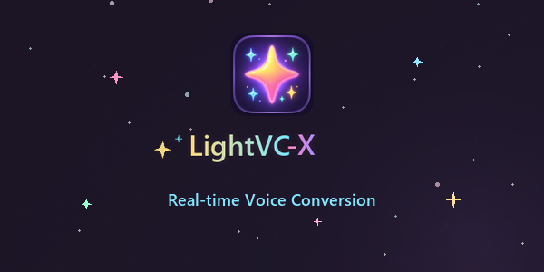

<p align="center">
  
</p>

<h1 align="center">LightVC</h1>

<p align="center">
  Real-time voice conversion as a Rust desktop application and CLAP/VST3 plugin.<br>
  Codec-space VC with UTTE cross-attention adapter — pure Rust inference.
</p>

<p align="center">
  <a href="#quick-start">Quick Start</a> ·
  <a href="#features">Features</a> ·
  <a href="#b1-adapter-pipeline">B1 Pipeline</a> ·
  <a href="docs/MANUAL.md">Manual</a> ·
  <a href="ARCHITECTURE.md">Architecture</a> ·
  <a href="#training">Training</a>
</p>

---

## Overview

LightVC converts voice identity in neural-codec space using a **UTTE cross-attention adapter** (B1 pipeline). The adapter modifies DAC (Descript Audio Codec) latents with target-speaker timbre tokens, then the frozen DAC decoder synthesizes the converted waveform. No heavy TTS, BigVGAN, or diffusion vocoder is involved.

```
Mic input
→ DAC encode
→ source depth-0 quantization (q0 content anchor)
→ soft RVQ re-quantization (differentiable, τ=5.0)
→ UTTE cross-attention adapter (ECAPA timbre → 32 tokens × frame attention)
→ DAC decode
→ output
```

### Evaluation Results (VCTK, 200-pair bootstrap CI)

| Condition | target SECS | source SECS | margin | oracle ratio |
|-----------|------------|------------|--------|-------------|
| **Offline B1** | **0.508** [0.493, 0.522] | **0.238** [0.220, 0.259] | **+0.269** [+0.242, +0.294] | **79.2%** |
| Oracle (src\_K1) | 0.641 | 0.108 | +0.533 | 100% |

Offline B1 achieves 79% of oracle quality. The adapter is 3.5M params; the only trained component in the pipeline.

## Features

- **UTTE cross-attention adapter** — ECAPA 1-vector → 32 tokens, frame-level FiLM + MHA
- **Codec-space VC** — no waveform generation, no heavy vocoder
- **Pure Rust inference** — Candle, no Python runtime at deployment
- **CUDA acceleration** — processing <30ms per chunk on RTX 2080 Ti
- **Streaming pipeline** — Balanced mode (4f chunk, ~46ms algorithmic latency)
- **Three form factors**:
  - Standalone GUI app (egui)
  - CLAP plugin (REAPER, Bitwig, etc.)
  - VST3 plugin (Ableton, FL Studio, etc.)
- **VC-teacher-free** — trained on real speech pairs, no synthetic targets
- **MIT licensed** — all dependencies MIT/ISC/Apache-2.0

## Quick Start

### Prerequisites

- Rust 1.75+ (2024 edition)
- CUDA toolkit (for GPU inference; CPU also works but slower for decode)
- Python 3.10+ with [uv](https://github.com/astral-sh/uv) (training and timbre extraction only)
- Model weights (see below)

### Required Weights

| File | Source | Size |
|------|--------|------|
| `models/dac_44khz.safetensors` | [descript/dac_44khz](https://huggingface.co/descript/dac_44khz) `model.safetensors` | ~307 MB |
| `models/dac_quantizer.safetensors` | `uv run python -c "..."` (see below) | ~3 MB |
| `models/utte_adapter_b1.safetensors` | Exported from training checkpoint | ~7 MB |
| `timbre.safetensors` | ECAPA embedding of reference speaker | ~2 KB |

Export quantizer and timbre:
```bash
cd training && uv sync

# Export DAC quantizer weights (one-time)
uv run python -c "
from transformers import AutoModel
from safetensors.torch import save_file
dac = AutoModel.from_pretrained('descript/dac_44khz')
sd = {k: v.float() for k, v in dac.state_dict().items() if 'quantizer' in k}
save_file(sd, '../models/dac_quantizer.safetensors')
print(f'Saved {len(sd)} quantizer tensors')
"

# Extract timbre from reference speaker audio
uv run python extract_timbre.py path/to/reference.wav ../models/timbre_target.safetensors
```

### Build & Convert

```bash
# Build
cargo build --release -p lightvc-app

# Offline B1 conversion (pure Rust, no Python needed)
./target/release/lightvc-app convert-b1 \
    -i input.wav \
    -t models/timbre_target.safetensors \
    -o converted.wav \
    --dac-weights models/dac_44khz.safetensors \
    --quantizer-weights models/dac_quantizer.safetensors \
    --adapter-weights models/utte_adapter_b1.safetensors \
    --mode balanced --cuda
```

### GUI

```bash
./target/release/lightvc-app gui --dac-weights models/dac_44khz.safetensors --cuda
```

In the Realtime tab, expand **"B1 Adapter (UTTE)"** section:
1. Enter paths for adapter, quantizer, and timbre weights
2. Click **"Load B1 Adapter"**
3. Select input/output audio devices
4. Click **Start**

Runtime controls: Tau slider (adapter temperature), Wet/Dry mix.

### CLI Subcommands

```bash
# DAC round-trip validation
lightvc-app roundtrip -i input.wav -o output.wav --dac-weights models/dac_44khz.safetensors

# B1 offline conversion (recommended)
lightvc-app convert-b1 -i src.wav -t timbre.safetensors -o out.wav --cuda

# Legacy converter (frozen, historical)
lightvc-app convert -i src.wav -r ref.wav -o out.wav --converter-weights converter.safetensors

# GUI
lightvc-app gui --cuda
```

## B1 Adapter Pipeline

The B1 pipeline converts speaker identity while preserving content:

| Component | Implementation | Params | Role |
|-----------|---------------|--------|------|
| DAC encoder | Frozen | 28M | PCM → latent [1024, T] |
| Depth-0 quantizer | Frozen | ~2M | Content anchor (q0) |
| Soft RVQ | Frozen, τ=5.0 | 0 | Differentiable re-quantization |
| **UTTE adapter** | **Trained** | **3.5M** | **Timbre conditioning (ECAPA → 32 tokens → cross-attention)** |
| DAC decoder | Frozen | 48M | Latent → PCM |

### Rust/Candle Modules

| Module | File | Description |
|--------|------|-------------|
| `soft_rvq.rs` | `crates/lightvc-core/src/` | Differentiable soft RVQ with per-depth codebooks |
| `utte_adapter.rs` | `crates/lightvc-core/src/` | UTTE cross-attention adapter (Conv1d + MHA) |
| `b1_pipeline.rs` | `crates/lightvc-core/src/` | B1Streaming + B1Offline + latency instrumentation |
| `Backend` enum | `crates/lightvc-core/src/lib.rs` | Legacy(VcPipeline) \| B1(B1Streaming) dispatch |

Python ↔ Rust parity: MSE = 0 for soft RVQ, adapter, and full decode pipeline.

### CUDA Latency (RTX 2080 Ti)

| Component | Strict (1f) | Balanced (4f) |
|-----------|------------|--------------|
| DAC encode | 2.0 ms | 4.1 ms |
| Soft RVQ + adapter | 0.5 ms | 2.7 ms |
| DAC decode | 4.4 ms | 13.6 ms |
| **VC processing** | **6.9 ms** | **20.4 ms** |
| + Resampling + I/O | ~12 ms | ~12 ms |
| **Total** | **~19 ms** | **~32 ms** |

### Streaming Quality

Short-window DAC decode introduces boundary artifacts (non-causal decoder). Balanced mode (B/C quality) is the recommended realtime mode. Strict mode (1f decode) is not viable for production.

| Condition | target SECS | margin | Quality |
|-----------|------------|--------|---------|
| Offline | 0.51 | +0.27 | A (clean) |
| Balanced 4f streaming | 0.41 | +0.12 | B/C (mild boundary) |

## Training

The B1 adapter is trained in Python (PyTorch + uv). Training and inference are fully separated — the adapter weights export to safetensors for Rust/Candle inference.

### Training Pipeline

```bash
cd training && uv sync

# 1. Prepare same-text VCTK pairs (10K recommended)
uv run python phase3_prepare.py \
    --source ../data/vctk_200 --output ../data/phase3_10k \
    --n_pairs 10000 --holdout 200 --seed 20260621

# 2. Train UTTE adapter (adapter_only, ~15 epochs)
uv run python train_phase3c_adapter.py \
    --adapter_only \
    --data_dir ../data/phase3_10k \
    --ckpt_dir checkpoints/phase3c_ao_b1_ecapa \
    --utte_mode ecapa --film_mode none \
    --epochs 15 --batch_size 2 --max_frames 256 \
    --tau 5.0 --adapter_lr 1e-4 --delta_reg 0.1

# 3. Evaluate (200-pair bootstrap CI)
uv run python eval_phase3c_full.py \
    --checkpoint checkpoints/phase3c_ao_b1_ecapa/best.pt \
    --data_dir ../data/phase3_10k

# 4. Export adapter weights for Rust
uv run python export_b1_adapter.py \
    --checkpoint checkpoints/phase3c_ao_b1_ecapa/best.pt \
    --output ../models/utte_adapter_b1.safetensors

# 5. Streaming evaluation
uv run python eval_streaming.py --n_pairs 25
```

### Research History

| Phase | Approach | Result | Status |
|-------|----------|--------|--------|
| 1b | RVQ residual chain oracle | SECS 0.686 | ✅ Validated |
| 2c | Wav2Vec2 DTW same-text | SECS 0.656 | ✅ Validated |
| 3 | Latent/code/embedding generator | SECS 0.03 | ✗ Collapse |
| 3b | Audio-domain loss (no adapter) | SECS 0.14 | ✗ Plateau |
| 3c | TimbreAdapter FiLM | SECS 0.42 | ⚠ Partial |
| **3c** | **UTTE cross-attention** | **SECS 0.51** | **✅ Strong Go** |

Key finding: the bottleneck was **FiLM conditioning**, not ECAPA information content. Cross-attention with ECAPA-derived tokens achieved 3× the target SECS of FiLM.

## Project Structure

```
LightVC/
├── crates/
│   ├── lightvc-core/      Core: DAC, soft RVQ, UTTE adapter, B1 pipeline, streaming
│   ├── lightvc-audio/     Audio I/O: cpal, resampling, ring buffers
│   ├── lightvc-app/       Standalone GUI + CLI (convert-b1, gui, roundtrip)
│   ├── lightvc-clap/      CLAP/VST3 plugin
│   └── lightvc-xtask/     Build automation
├── training/              Python training (uv): adapter training, eval, export
├── models/                Weights (.safetensors, git-ignored)
├── results/               Evaluation JSONs
├── samples/               Audio samples
├── docs/                  Research reports, literature updates
└── plan/                  Design documents (12_concept_v2, 13_realtime_singing)
```

## Architecture

- **Codec**: DAC (Descript Audio Codec), 44.1kHz, 9 RVQ codebooks, MIT license
- **Adapter**: UTTE cross-attention (Conv1d + ECAPA tokens + 4-head MHA), 3.5M params
- **Inference**: Candle (pure Rust), CUDA / CPU / Metal
- **Training**: PyTorch (uv environment), CUDA
- **Plugin**: nice-plug (ISC) + clap-wrapper (MIT) → CLAP + VST3
- **Audio**: cpal (WASAPI/ASIO/CoreAudio/ALSA)

## Documents

- [DESIGN.md](DESIGN.md) — High-level design and rationale
- [ARCHITECTURE.md](ARCHITECTURE.md) — System architecture detail
- [RESEARCH.md](RESEARCH.md) — Literature survey and evidence base
- [plan/13_realtime_singing_redesign.md](plan/13_realtime_singing_redesign.md) — Current research plan
- [docs/research_report_2026-06-20.md](docs/research_report_2026-06-20.md) — Experiment report
- [docs/literature_update_2026-06-21.md](docs/literature_update_2026-06-21.md) — Literature update
- [docs/paper_trial_report_2026-06-24.md](docs/paper_trial_report_2026-06-24.md) — Paper trial report

## License

MIT — all dependencies are MIT/ISC/Apache-2.0. No GPLv3.
